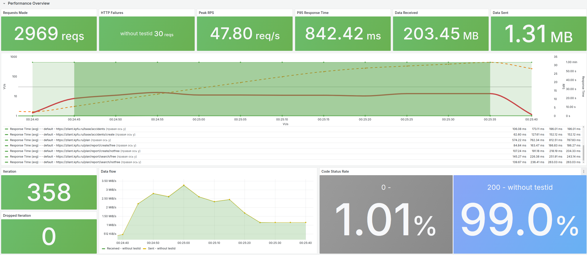

## Привет! Я Дмитрий 👋🏻

Мои технические навыки и опыт их применения 👇🏻:

СУБД (PostgreSQL MS SQL & MongoDB & Milvus)

### PostgreSQL

...

### MS SQL

...

### MongoDB

...

### Milvus

Система распознавания лиц (CV):
- создание эмбеддингов через ResNet-50;
- однозначная идентификация человека по лицу + поиск подобных лиц;
- поиск на базе индексов Milvus.

Apache (Airflow & Spark & Kafka)

### Apache Airflow

...

### Apache Spark

...

### Apache Kafka

...

Grafana (Prometheus & Loki & K6 & Grafana)

### Prometheus

...

### Loki

...

### K6

Нагрузочное тестирование веб-приложений:
- проверка latency запросов к API / страницам;
- поиск медленных страниц для оптимизации;
- оценка максимальной пропускной способности системы.

### Grafana

...

