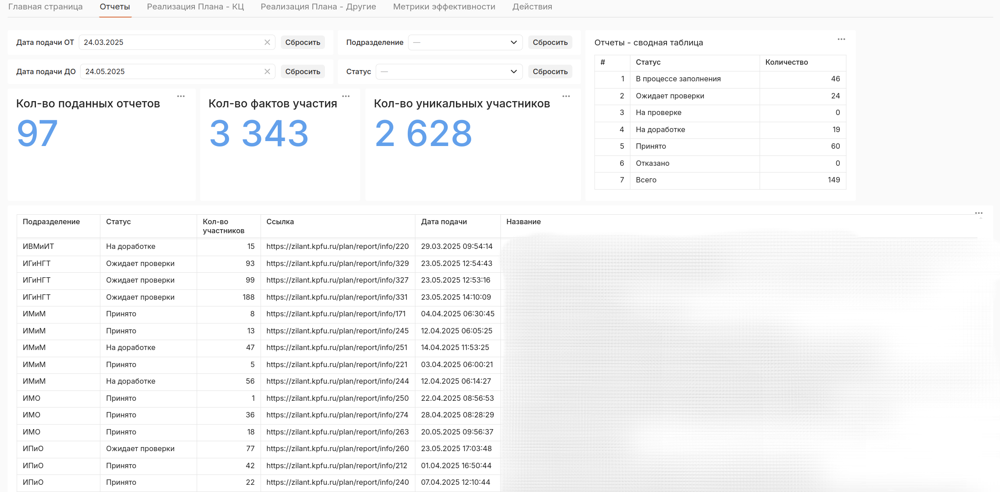

## Привет! Я Дмитрий 👋🏻
> [!IMPORTANT]
> Data Engineer с опытом построения ETL-систем и хранилищ данных для госсектора и образования. 
> Разрабатываю DWH и ETL-пайплайны, витрины данных и BI. 
> С опытом в fullstack (Python&Django) и ML (PyTorch), что позволяет проектировать комплексные data-решения. 

## Технологический стек 🔨:
- **БД**: PostgreSQL, MS SQL, MongoDB, Milvus;
- **Data pipelines**: Airflow, Spark, Kafka;
- **Инфраструктура**: Docker, Kubernetes (базовое развертывание), Yandex Cloud;
- **Мониторинг**: Prometheus, Loki, Grafana, K6;
- **BI**: Yandex Datalens;

## Опыт
Казанский федеральный университет | Инженер данных | Октябрь 2022 — н.в.

- **DWH (PostgreSQL).** Спроектировал и разработал хранилище данных с поддержкой историчности (140 таблиц, 3NF и DataVault);
- **ETL/ETL (Airflow).** Разработал пайплайны для обработки 2M+ записей/день из VK, Telegram. Решение предотвратило 3 кризисные ситуации и использовалось в дальнейшей отчетности;
- **Spark**. Реализовал распределенную обработку данных, ускорив аналитику на 70%;
- **Yandex DataLens**. Внедрил дашборды, используемые Минобрнауки для мониторинга социальных рисков с охватом 14 регионов ПФО;
- **Kafka CDC**. Настроил синхронизацию между БД организации, обеспечив актуальность данных для 140 пользователей;
- **Prometheus/Grafana**. Создал систему алертинга, сократив время реакции на сбои с 8 ч до 1 ч;
- **Docker**. Упаковал 9 сервисов в docker-контейнеры, обеспечив отказоустойчивость через health checks, достигнув uptime ~99.9%.

## Примеры работ 👨‍💻:

<b>БД</b> (PostgreSQL MS SQL & MongoDB & Milvus)

### PostgreSQL

...

### MS SQL

...

### MongoDB

...

### Milvus

Система распознавания лиц (CV):
- создание эмбеддингов через ResNet-50;
- однозначная идентификация человека по лицу + поиск подобных лиц;
- поиск на базе индексов Milvus.

<b>Data pipelines</b> (Airflow & Spark & Kafka)

### Apache Airflow

...

### Apache Spark

...

### Apache Kafka

...

<b>Мониторинг</b> (Prometheus & Loki & Grafana)

### Prometheus

...

### Loki

...

### Grafana

...

<b>BI</b> (Yandex Datalens & Google Sheets & Matplotlib & Seaborn)

### Yandex Datalens
Интерактивные дашборды:
- контроль исполнения задач подразделениями;
- мониторинг эффективности работы в корпоративной системе.

<b>Тестирование</b> (K6 & PgBench & Selenium)

### K6

Нагрузочное тестирование веб-приложений:
- проверка latency запросов к API / страницам;
- поиск медленных страниц для оптимизации;
- оценка максимальной пропускной способности системы.

### PgBench

...

## Образование 👨‍🎓
Казанский (Приволжский) федеральный университет 
Бакалавр "Программная инженерия" 
 
Курсы: 
«Инженер облачных сервисов» | [Yandex Cloud](https://start.practicum.yandex/ycloud/) 
«Managed Service for Kubernetes» | [Yandex Cloud](https://yandex.cloud/ru/training/kubernetes) 
«Введение в параллельное программирование (OpenMP и MPI)» | [ТГУ](https://stepik.org/course/115024/syllabus)
